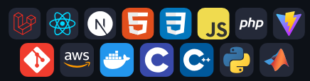

# Bio
## 構成
1. ランディングメッセージ
2. ヘッダー
3. ポートフォリオ
   1. Dokoiku VR
   2. Ultimate Todo
   3. Biography
   4. instaVRam (開発中)
4. 紹介
   1. 経歴
   2. 趣味
   3. 実績
5. 問い合わせ先

## ヘッダー
- 特に記載なし

## ランディングメッセージ
- "Welcome" という文字
- フェードイン時には、写真を右からスライドインさせ、アイコンは左からスライドインさせる。

## ポートフォリオ
- 経歴より開発したもので語りたいので、最初に表示する。
- ポートフォリオ写真をスライドショー形式にする。上下にスライドできるようにしたい。
- 写真に番号とタイトルと使用技術スタックのアイコンやらを載せる
- ウィンドウだけで完結するため、ホイールスクロールで次の写真が出るようにする。
- クリックすると詳細画面に遷移したい。

## ポートフォリオ詳細画面
- ポートフォリオの代表的な一枚絵を表示、そこにタイトルを重ねて表示
- 簡単な紹介と実績を表示
- 作成した年月日
- 使用技術スタック

## 紹介
- アイコンにホバーすると、吹き出しが４つ表示され、クリックすると表示。
1. ポートフォリオ（初期状態）
1. 経歴
  - Software/Application Development Engineer (h1)
    - Semiconductor Fault Screening Application Development
    - New Product Development and Market Research
    - Measurement Data Analysis Application Development
    - Factory Automation Dev/Ops Engineering
  - 技術スタック、アイコンだけに使用
    - 業務レベル
      - Python
      - C/C++
      - Matlab
      - Git
    - 実践レベル
      - Laravel/PHP
      - MySQL
      - React
      - Tailwind CSS
    - 学習中
      - Next.js
      - TypeScript
      - Docker
      - AWS
2. 実績・論文
  - Recognition Award for Outstanding Performance (2023) (h1)
  - Patent: 非破壊検査手法 (2022)
  - Acoustical Society of Japan Student Excellence Award 日本音響学会 学生優秀賞 (2019) (h1)
3. 趣味・興味
  - 笑うことが好き
  - XR
  - Audio Signal Processing
  - Music Composing/Listening
    - Youtube
  - Illustrating
  - Trip

## フッター
- (C) BardBlue/Montblanc を右下に

